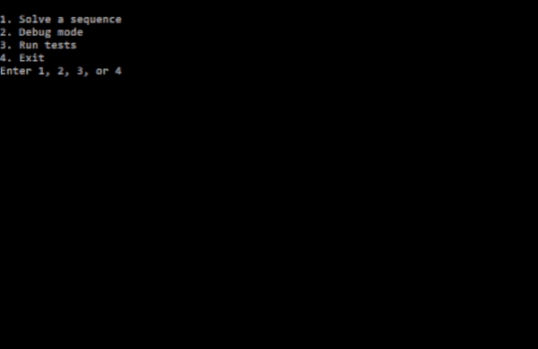

# Tetris Solver

## Contents
- Overview
- Working Princinples
- Additional Features
- Add Custom Tetrominos
- License

## Overview

- Given a sequence of tetrominos, this program will compute and display a way of dropping them into a grid such that the height of the resulting tetromino stack is minimised.
- The result displays which columns each tetromino should be dropped in, and the angle at which the tetrominos should be rotated before being dropped. The user can also specify to use the default rotations of tetrominos only.
- Dimensions of the grid are determined by the ```GRID_HEIGHT``` and ```GRID_WIDTH``` macros in ```grid.h```.
- Maximum allowed length for a tetromino sequence is determined by the ```MAX_SEQUENCE_SIZE``` macro in ```tetromino.h```.

## Working Principles
- The best **permutation** (a column/rotation value for each tetromino) is calculated by trying all possible permutations and saving the one which produced the shortest stack. The order in which the permutations are tried is shown below:
![Working Principles: Solving]{readme_animations/working_principles_solving.gif}
- A tetromino can be dropped into ```GRID_WIDTH + 1 - TETROMINO_WIDTH``` columns, where ```TETROMINO_WIDTH``` is the width of a tetromino in a **specific rotation** (0, 90, 180, or 270 degrees). If the tetromino has ```r``` rotations, (assuming its width is the same in all rotations) the number of permutations for that tetromino becomes ```r * (GRID_WIDTH + 1 - TETROMINO_WIDTH)```. Therefore, the number of permutations for a sequence of length ```n``` becomes ```(r * (GRID_WIDTH + 1 - TETROMINO_WIDTH)) ** n```.
- In order to handle the exponentially growing number of permutations, certain **optimisations** are implemented:
    - **Divide and Conquer:** The search space of all permutations is divided and assigned to ```solver``` units which independently try the permutations assigned to them. Each solver unit runs on a seperate solver thread for **concurrent** operation. **Multi-threading** is supported for **Windows** and **Linux**, otherwise a single solver unit is used which runs on the main thread. The number of solver units is determined by the ```NUMBER_OF_SOLVERS``` macro in ```solver.h``` (defaults to 16 for Windows/Linux).
    - **Efficient Collision Detection:** When dropping tetrominos into a grid, the state of the grid is stored and updated using the column heights of the grid/tetromino, instead of scanning the values in each cell.
    - **Grid State Restoration**: When trying a permutation, the grid state obtained after dropping each tetromino is individually saved. Given that the next permutation changes the column/rotation of piece ```n```, restore the grid state from the previous permutation before dropping piece ```n``` to avoid dropping these pieces again. This significantly reduces the number of collision detection calculations
    - **Search Tree Pruning**: During solving, given that the current best permutation gives stack height is ```m```, and the length of the sequence is ```n```, if dropping the first ```p``` (such that ```p < n```) pieces gives a stack height ```>= m```, skip all permutations which have the prefix of the first ```p``` pieces at their current orientation. This is shown in practice in the demo below:
    ![Pruning Optimisation]{readme_animations/working_principles_pruning_optimisation.gif}

## Additional Features
- **Debug mode**: 
- **Tests**: 
- **Overflow detection**: If the number of permutations for a sequence is greater than 2^64, an overflow in the 64-bit permutation counter is detected and the solving operation is aborted as all permutations cannot be tried.

## Add Custom Tetrominos
If you need other shapes which are specific to your problem domain, you can add tetrominos with custom shapes:
    - In ```tetromino.c``` define a ```tetromino``` struct for each rotation of your custom tetromino. In the ```Pattern``` attribute enter a ```'_'``` for blank cells and a different ```char``` which will represent your tetromino for other cells. **Maximum dimensions for a tetromino are 4x4**.
    - Declare your tetromino struct in ```tetromino.h```.
    - 

## License